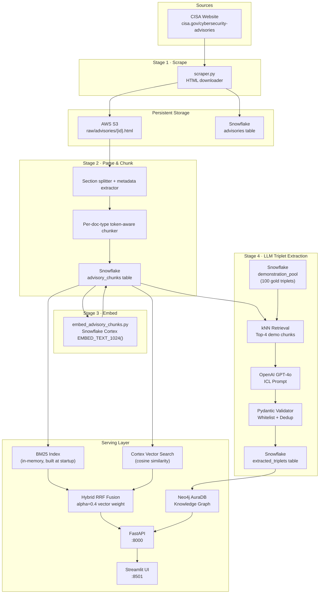
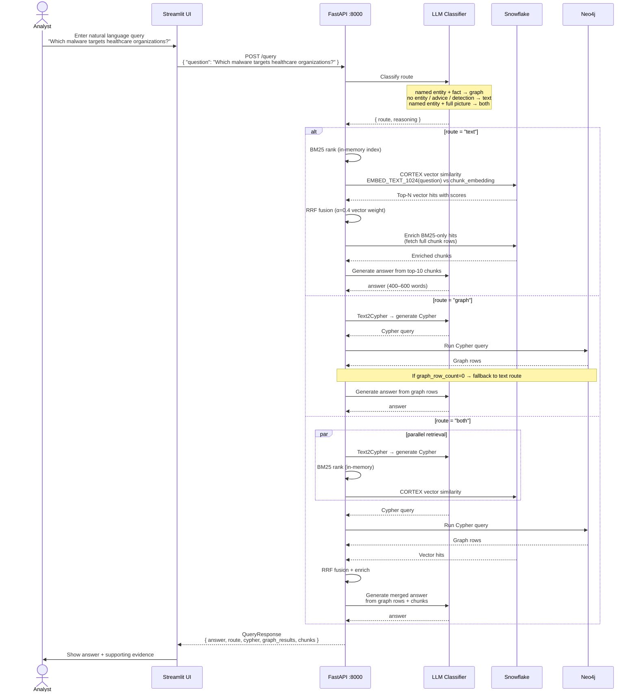
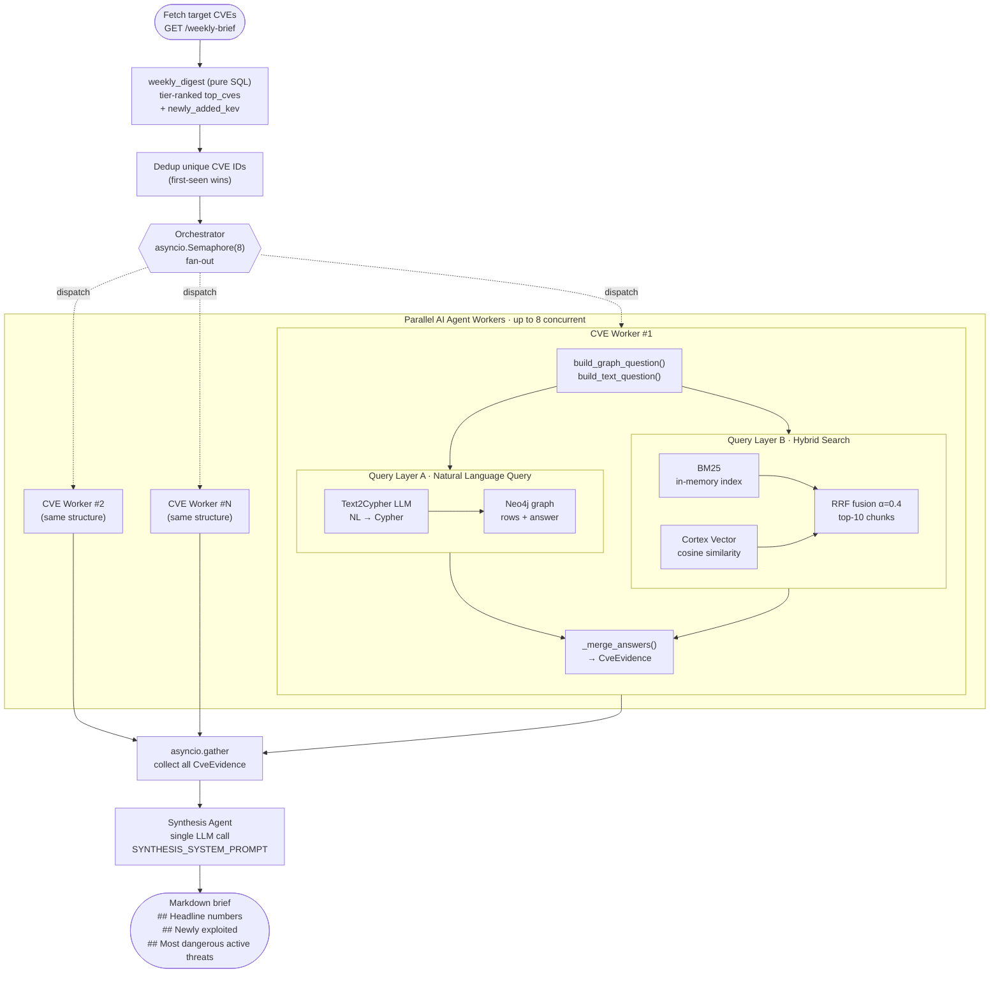

# Work disclosure: Required attestation and contribution declaration on the GitHub page:
WE ATTEST THAT WE HAVEN'T USED ANY OTHER STUDENTS' WORK IN OUR ASSIGNMENT AND ABIDE BY THE POLICIES LISTED IN THE STUDENT HANDBOOK
* Wei-Cheng Tu: 33.3%
* Nisarg Sheth: 33.3%
* Yu-Tzu Li: 33.3%

---

## CTI Graph Console (application deliverables)

This section records **our team’s application-layer work** in this repository: the FastAPI CTI service extensions, the Streamlit “CTI Graph Console” (Home dashboard, shared theme, Attack Path Explorer), and supporting tests. It is separate from the **Unstructured Advisory Pipeline** section below and is intended to support the final project report.

### FastAPI — operational metrics API

Snowflake-backed read endpoints for the **Scene 1** operational dashboard and other UIs:

| Module | Role |
|--------|------|
| [`app/services/metrics.py`](app/services/metrics.py) | Aggregations: CVE totals, KEV counts, `attack_techniques` count, `advisories` count, severity distribution, top KEV rows, recent `pipeline_runs`, freshness (`MAX(completed_at)` per source). |
| [`app/routers/metrics.py`](app/routers/metrics.py) | HTTP surface for the above. |
| [`app/main.py`](app/main.py) / [`app/routers/__init__.py`](app/routers/__init__.py) | Router registration. |

**Endpoints (all `GET`, JSON):**

- `/metrics/overview` — `total_cves_ingested`, `kev_flagged`, `attack_techniques_loaded`, `advisories_indexed`
- `/metrics/severity-distribution` — `{ "items": [ { "severity", "count" }, ... ] }` from `cve_records` (`vuln_status <> 'REJECTED'`)
- `/metrics/top-kev?limit=5` — latest KEV-added CVEs (same shape as dashboard table)
- `/metrics/pipeline-runs?limit=10` — last runs from `pipeline_runs` (DAG, source, status, rows, duration, timestamp)
- `/metrics/freshness` — last `completed_at` keyed as `nvd`, `kev`, `attck` / `mitre_attck`, `neo4j` (from `pipeline_runs.source`)

### Streamlit — Home operational dashboard

| Artifact | Description |
|----------|-------------|
| [`streamlit_cti/Home.py`](streamlit_cti/Home.py) | **Scene 1** layout: KPI cards, severity bar chart, top-5 KEV table, pipeline runs table (status styling), freshness tiles; per-panel error handling if an endpoint fails. |
| [`streamlit_cti/lib/client.py`](streamlit_cti/lib/client.py) | `get_metrics_*` helpers calling the `/metrics/*` routes with the same base URL pattern as other pages. |

### Streamlit — shared theme

| Artifact | Description |
|----------|-------------|
| [`streamlit_cti/theme.py`](streamlit_cti/theme.py) | Global CSS tokens (Syne / JetBrains Mono, dark surfaces, inputs, buttons, alerts) injected after `st.set_page_config`. |
| **Pages wired** | Home, Attack Path, NL Query, Weekly Brief, Vector DB Eval call `inject_global_theme()` after page config. |
| **Fixes** | Removed a one-shot `session_state` guard that skipped CSS on multipage sidebar navigation (stale “default” UI); adjusted BaseWeb `select` / multiselect styling so Vector Eval multiselects do not show a dark “blob” artifact. |

### Streamlit — Attack Path Explorer

| Topic | Implementation notes |
|-------|-------------------------|
| **List / detail correctness** | Detail panel uses a **focus node** derived from path structure (`_focus_node`): CVE-first paths under Technique mode show full **CVSS / KEV** blocks; Actor/Technique starts prefer the **first CVE on the path** when present, with a short “via actor / technique” line. Routing uses **primary Neo4j label**, not only the start-type tab. |
| **Metrics row** | For CVE start, fourth tile stays **“KEV flagged”** (first node KEV). For Actor/Technique, it becomes **“Paths w/ KEV CVE”** (any KEV-flagged CVE on the path). Path cards reuse the focus node for KEV/severity badges where applicable. |
| **CVE profile UX** | Per-path actions use `st.button(..., on_click=…)`; selection is clamped to valid indices; **persisted `code == 200` + non-dict `data`** is sanitized so a cold open does not show a phantom error. |
| **Actor dropdown** | `_load_actors` wrapped in try/except so transport errors do not crash the page. |
| **Quick picks (pre-fetch)** | When **CVE** mode and no results loaded yet (`ap_last_code is None`), the search panel shows **five “recently added KEV”** cards from `GET /metrics/top-kev` (cached); **“Use this CVE”** sets `st.session_state["ap_from_cve"]` so the CVE field prefills before **Fetch paths**. |

### Airflow — S3, KEV sync, and Neo4j (structured CTI)

Orchestration lives under [`airflow/dags/`](airflow/dags/). The repo [`README.md`](README.md) documents the full DAG set; **for the final report we call out only these three themes** (NVD staging on **S3**, **KEV** sync, and **Neo4j** structured sync).

**S3 — NVD raw / curated staging (`s3://$S3_BUCKET/nvd/...`)**

| DAG | File | Role |
|-----|------|------|
| **`nvd_fetch_dag`** | [`airflow/dags/nvd_fetch_dag.py`](airflow/dags/nvd_fetch_dag.py) | NVD API → **S3** raw month files (`*.jsonl`), mapped tasks per month; triggers transform downstream. |
| **`nvd_transform_dag`** | [`airflow/dags/nvd_transform_dag.py`](airflow/dags/nvd_transform_dag.py) | **S3** raw JSONL → **S3** curated NDJSON per month (`schedule=None`, triggered). |
| **`nvd_s3_slice_pipeline_dag`** | [`airflow/dags/nvd_s3_slice_pipeline_dag.py`](airflow/dags/nvd_s3_slice_pipeline_dag.py) | Incremental **date-sliced** pipeline: per slice, **fetch → transform → load** with intermediate objects on **S3** (slice prefixes under the bucket) before Snowflake merge; uses checkpoint **`nvd_s3_slice_pipeline_through`**. |

**KEV sync**

| DAG | File | Role |
|-----|------|------|
| **`kev_sync_dag`** | [`airflow/dags/kev_sync_dag.py`](airflow/dags/kev_sync_dag.py) | **`fetch_and_enrich`** (CISA KEV → Snowflake **`cve_records`**), **`resolve_pending`** (drain **`kev_pending_fetch`** / NVD backfill), then **`sync_kev_neo4j`** to update **KEV-related properties on existing `(:CVE)` nodes** in Neo4j. |

**Neo4j — structured graph catch-up**

| DAG | File | Role |
|-----|------|------|
| **`neo4j_structured_sync_dag`** | [`airflow/dags/neo4j_structured_sync_dag.py`](airflow/dags/neo4j_structured_sync_dag.py) | Snowflake → Neo4j for **structured** CTI entities: **`cve_cwe_kev_sync`**, **`attack_techniques_sync`**, **`chunk_technique_links_sync`**, driven by `loaded_to_neo4j` / graph-sync scripts (separate from the unstructured advisory HTML pipeline). |

### Automated tests (metrics)

- [`tests/unit/test_cti_routers.py`](tests/unit/test_cti_routers.py) — mocked coverage for `/metrics/overview`, `/metrics/severity-distribution`, `/metrics/pipeline-runs` response shapes.

---

# Unstructured Advisory Pipeline

This pipeline ingests **CISA Cybersecurity Advisories** (HTML) and converts them into structured, searchable knowledge — chunks stored in Snowflake with vector embeddings, and knowledge-graph triplets in neo4j.

---

## Prerequisites

| Requirement | Version |
|------------|---------|
| Python | 3.11+ |
| Poetry | 2.2.1 |
| Pydantic | 2.5.3 |
| Docker | 20.10.24 |
| Docker Compose | 2.17.2 |
| Snowflake | — |
| AWS S3 bucket | — |
| AWS EC2 | — |
| OpenAI API key | GPT-4o |
| Neo4j AuraDB instance | — |

## Table of Contents

1. [CTI Graph Console (application deliverables)](#cti-graph-console-application-deliverables)
2. [Overview](#overview)
3. [Architecture](#architecture)
4. [User Flow](#user-flow)
5. [Prerequisites](#prerequisites)
6. [Environment Setup](#environment-setup)

---

## Overview

The unstructured pipeline has 6 main stages:

| Stage |
|-------|
| **1 — Scrape** |
| **2 — Parse & Chunk** |
| **3 — Embed** |
| **4 — Extract Triplets** |
| **5 — Deduplication Entity** |
| **6 — Relation Inference** |

---

## Architecture



---

## User Flow

### NL Query



### Weekly Brief



---

## Pipeline Description

### Stage 1 — Scrape

The scraper paginates through the CISA advisory listing at `cisa.gov/news-events/cybersecurity-advisories`, collecting two advisory types: **Analysis Reports** and **Cybersecurity Advisories**. For each new entry it extracts `advisory_id`, title, URL, publish date, and type, then downloads the full HTML page, uploads it to **AWS S3** at `raw/advisories/{advisory_id}.html`, and inserts the metadata into the Snowflake `advisories` table.

### Stage 2 — Parse & Chunk

Raw HTML is retrieved from S3 and cleaned by stripping noise tags (`<script>`, `<style>`, `<nav>`, `<footer>`, etc.). The document is then split at heading boundaries (`h2` / `h3`) into semantic sections. Each section heading is mapped to a **canonical section name** — `Summary`, `Technical Detail`, `Mitigation`, `IoC`, `Detection`, or `General` — based on keyword matching.

Chunking strategy varies by document type: each type has a maximum token budget and a preferred heading level. Sections that exceed the token limit are sub-split with a 100–200 token overlap to preserve context across boundaries.

| Document Type | Max Tokens |
|--------------|-----------|
| MAR | 1400 |
| ANALYSIS_REPORT | 1200 |
| JOINT_CSA | 1000 |
| STOPRANSOMWARE | 1000 |
| CSA | 1000 |
| IR_LESSONS | 700 |

All chunks are written to the Snowflake `advisory_chunks` table.

### Stage 3 — Embed

For every chunk in `advisory_chunks`, the pipeline calls **Snowflake Cortex** `EMBED_TEXT_1024()` (arctic-embed-l-v2.0, 1024 dimensions) and writes the result back to the `chunk_embedding` column. The compute runs entirely inside Snowflake, keeping latency and cost low.

### Stage 4 — Extract Triplets

The goal of this stage is to have an LLM automatically extract structured knowledge from each advisory — specifically, triplets of the form `(subject, relation, object)` that capture "who did what to whom."

Before processing any new report, we use vector similarity to retrieve the 4 most similar reports from a **demonstration pool** of 100 manually annotated advisories, include their example triplets in the prompt, and let the LLM learn from them before answering.

Once the LLM returns its output, three filtering steps are applied:

1. **Relation whitelist** — only 7 relation types are accepted: `uses`, `targets`, `exploits`, `attributed_to`, `affects`, `has_weakness`, `mitigates`. Everything else is rejected.
2. **Vague-term filter** — subject and object cannot be non-specific phrases like "the attacker" or "malicious actors."
3. **Exact deduplication** — if identical triplets appear more than once in the same report, only one copy is kept.

Only triplets that pass all three checks are written to the `extracted_triplets` table in Snowflake.

### Stage 5 — Entity Deduplication

After Stage 4, different reports may refer to the same real-world entity under different names — for example, "APT29", "Cozy Bear", and "APT 29" all refer to the same group. Left unaddressed, these would appear as separate nodes in the knowledge graph.

To fix this, we collect all entity names from the database and convert each into a vector using Snowflake's built-in embedding model. We then compute cosine similarity: any pair scoring above **0.85** is flagged as a potential match.

Each candidate pair is sent to GPT-4o with the question: *"Are these two names the same real-world entity? If so, which name should be the canonical form?"* If GPT-4o confirms a match, all aliases are replaced with the canonical name throughout the database, and an additional round of deduplication removes any triplets that become identical after normalisation.

### Stage 6 — Relation Inference

After storing triplets into Neo4j, we noticed that nodes from the same report are not always connected — for example, a report might mention both that APT29 used Cobalt Strike and that a CVE affects Exchange Server, but never explicitly link those two facts. The result is disconnected subgraphs with no edges between them.

To fill in these missing links, we run a **Union-Find algorithm** on each report's subgraph to identify disconnected components. If only one component exists, the graph is already fully connected and we skip it. For reports with multiple components, we select the highest-degree node from each component as its representative, designate the most central one the **topic entity** (usually the main threat actor), and pair it with all other representatives.

Each pair — along with the report's full text — is sent to GPT-4o: *"Based on this report, what is the relationship between these two entities?"* If a clear relationship exists, GPT-4o returns a triplet; if not, we skip that pair.

### Serving — Query Flow

Users submit a natural language question through the Streamlit UI, which calls `POST /query`. The API first passes the question to an **LLM route classifier** that decides which retrieval strategy to use:

- **text route** — No specific named entity in the question, or the question asks for guidance, mitigation, or detection advice. The API runs **hybrid search** (BM25 in-memory index + Snowflake Cortex vector search, fused with Reciprocal Rank Fusion at α = 0.4) against `advisory_chunks` and feeds the top-10 results to an LLM to generate the final answer.
- **graph route** — The question names a specific entity and asks for a structured fact (e.g. "Which CVEs does Volt Typhoon exploit?"). The API calls **Text2Cypher** to generate a Cypher query, runs it against Neo4j, and synthesises the answer from the graph rows. If the query returns zero rows, the pipeline automatically falls back to the text route.
- **both route** — The question involves a specific entity but also asks for narrative context (detection, mitigation, full picture). The graph and text branches run **in parallel**; the LLM merges both result sets into a single answer.

The endpoint returns a `QueryResponse` containing the answer, the chosen route, optional Cypher, graph rows, and the supporting advisory chunks.

---

## Environment Setup

Minimum required for the unstructured pipeline:

```dotenv
# Snowflake
SNOWFLAKE_ACCOUNT=<org>-<account>
SNOWFLAKE_USER=your_user
SNOWFLAKE_PASSWORD=your_password
SNOWFLAKE_DATABASE=CTI_PLATFORM_DATABASE
SNOWFLAKE_SCHEMA=PUBLIC
SNOWFLAKE_WAREHOUSE=COMPUTE_WH

# AWS S3 (raw HTML storage)
AWS_ACCESS_KEY_ID=
AWS_SECRET_ACCESS_KEY=
AWS_REGION=us-east-1
S3_BUCKET=your-bucket-name

# OpenAI (Stage 4 triplet extraction)
OPENAI_API_KEY=

# Neo4j (serving layer)
NEO4J_URI=neo4j+s://xxxx.databases.neo4j.io
NEO4J_USERNAME=neo4j
NEO4J_PASSWORD=
```

---

## Running Locally

```bash
# Install dependencies
poetry install

# Start Redis
docker run -d --name redis-local -p 6379:6379 redis:7-alpine


# Start the server
poetry run uvicorn app.main:app --reload --port 8000
```

API docs available at `http://localhost:8000/docs`

## Running with Docker

```bash
docker compose -f docker/docker-compose.yml --env-file .env up --build
```
