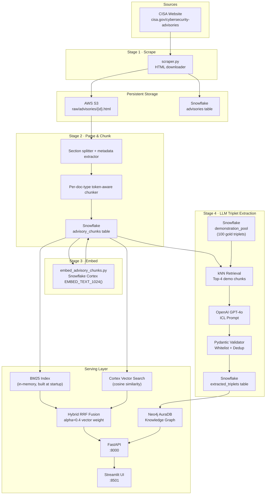
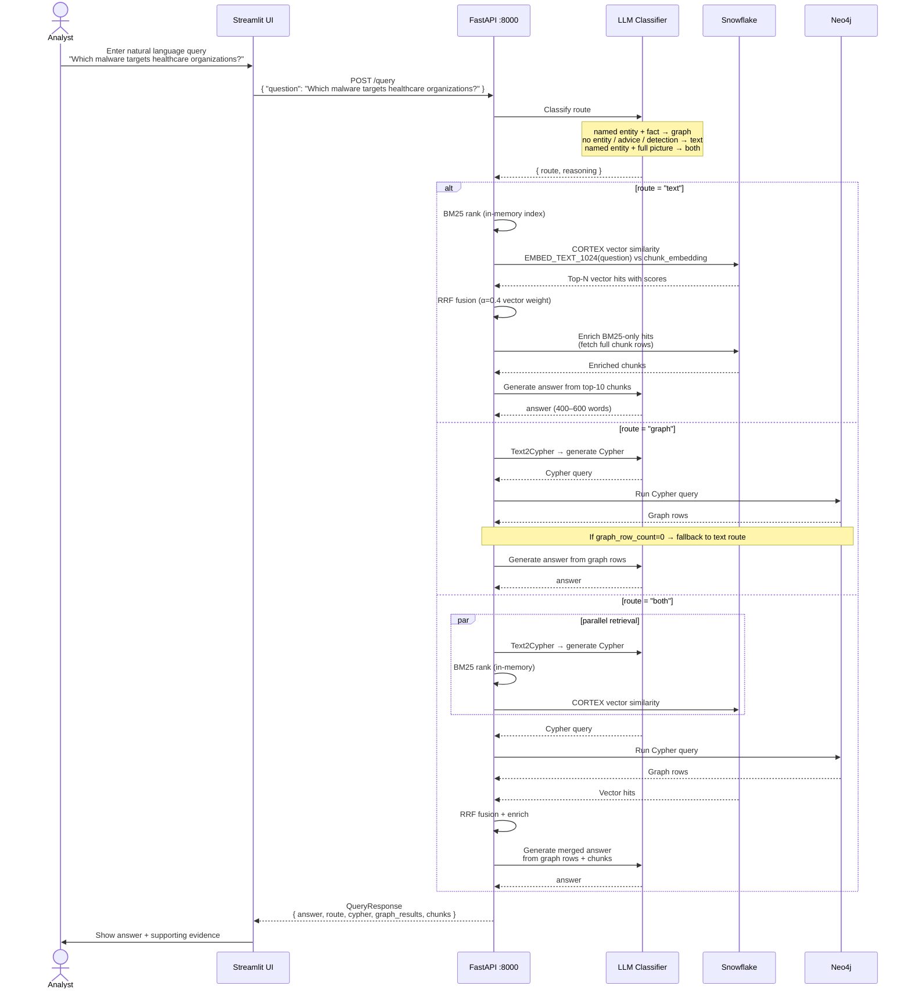
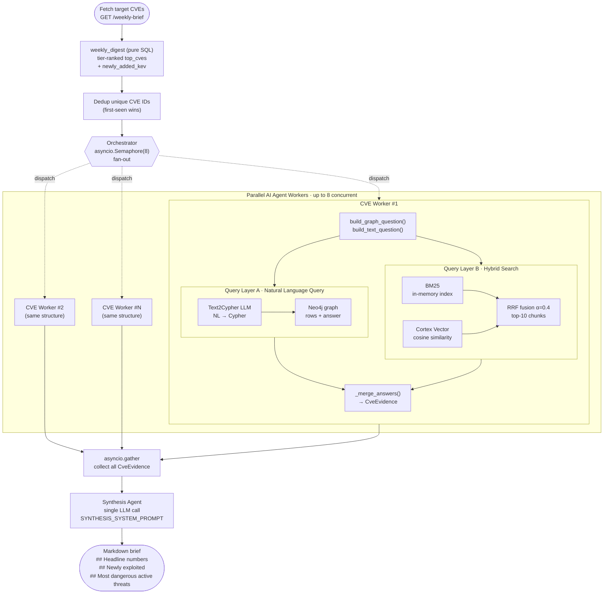

# Cyber Threat Intelligence Platform

WE ATTEST THAT WE HAVEN'T USED ANY OTHER STUDENTS' WORK IN OUR ASSIGNMENT AND ABIDE BY THE POLICIES LISTED IN THE STUDENT HANDBOOK

- Wei-Cheng Tu: 33.3%
- Nisarg Sheth: 33.3%
- Yu-Tzu Li: 33.3%

---

## Links

- Video: https://youtu.be/6Dxqd9D894g
- Website: http://35.93.255.114:8501/
- Google Doc: https://docs.google.com/document/d/1DCMEa1o1iLaozGY0VpRLzGYv_xMwoFTxowT8HaJmbcA
- Google colab: https://codelabs-preview.appspot.com/?file_id=1DCMEa1o1iLaozGY0VpRLzGYv_xMwoFTxowT8HaJmbcA#1

---

## Problem Statement

Cybersecurity analysts face a huge volume of cybersecurity threat reports scattered across different sources. Answering questions like "What could be the effect when attackers use some method to attack the server?" requires manually reading from different reports or references; this process may take hours to find the answer.

## Solution

Our platform, the Cyber Threat Intelligence Platform, automatically ingests both structured and unstructured sources like CISA Cybersecurity Advisories. Using a three-phase LLM pipeline, the platform extracts entity-relationship triplets from unstructured text, deduplicates entities, and infers missing relationships to construct a knowledge graph. Analysts can then query this graph using natural language through a Graph RAG engine, receiving answers that previously required hours of manual reading from different reports or references in under a few seconds.

---

## Table of Contents

1. [Prerequisites](#prerequisites)
2. [Environment Setup](#environment-setup)
3. [Running Locally](#running-locally)
4. [Running with Docker](#running-with-docker)
5. [Architecture](#architecture)
6. [User Flow](#user-flow)

---

## Prerequisites

| Requirement           | Version  |
| --------------------- | -------- |
| Python                | 3.11+    |
| Poetry                | 2.2.1    |
| Pydantic              | 2.5.3    |
| Docker                | 20.10.24 |
| Docker Compose        | 2.17.2   |
| Snowflake             | —        |
| AWS S3 bucket         | —        |
| AWS EC2               | —        |
| OpenAI API key        | GPT-4o   |
| Neo4j AuraDB instance | —        |

---

## Environment Setup

Create a `.env` file at the project root with the following variables:

```dotenv
# Snowflake
SNOWFLAKE_ACCOUNT=<org>-<account>
SNOWFLAKE_USER=your_user
SNOWFLAKE_PASSWORD=your_password
SNOWFLAKE_DATABASE=CTI_PLATFORM_DATABASE
SNOWFLAKE_SCHEMA=PUBLIC
SNOWFLAKE_WAREHOUSE=COMPUTE_WH

# AWS S3 (raw HTML storage)
AWS_ACCESS_KEY_ID=
AWS_SECRET_ACCESS_KEY=
AWS_REGION=us-east-1
S3_BUCKET=your-bucket-name

# OpenAI (Stage 4 triplet extraction)
OPENAI_API_KEY=

# Neo4j (serving layer)
NEO4J_URI=neo4j+s://xxxx.databases.neo4j.io
NEO4J_USERNAME=neo4j
NEO4J_PASSWORD=
```

---

## Running Locally

```bash
# Install dependencies
poetry install

# Start Redis
docker run -d --name redis-local -p 6379:6379 redis:7-alpine

# Start the server
poetry run uvicorn app.main:app --reload --port 8000
```

API docs available at `http://localhost:8000/docs`.

## Running with Docker

```bash
docker compose -f docker/docker-compose.yml --env-file .env up --build
```

---

## Architecture



---

## User Flow

### NL Query



### Weekly Brief


